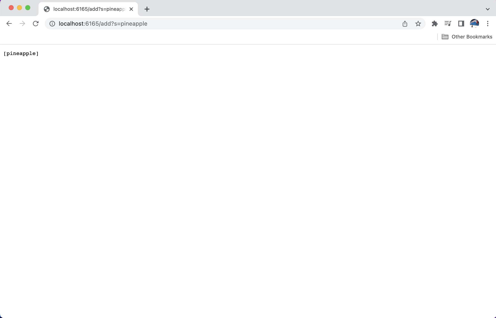
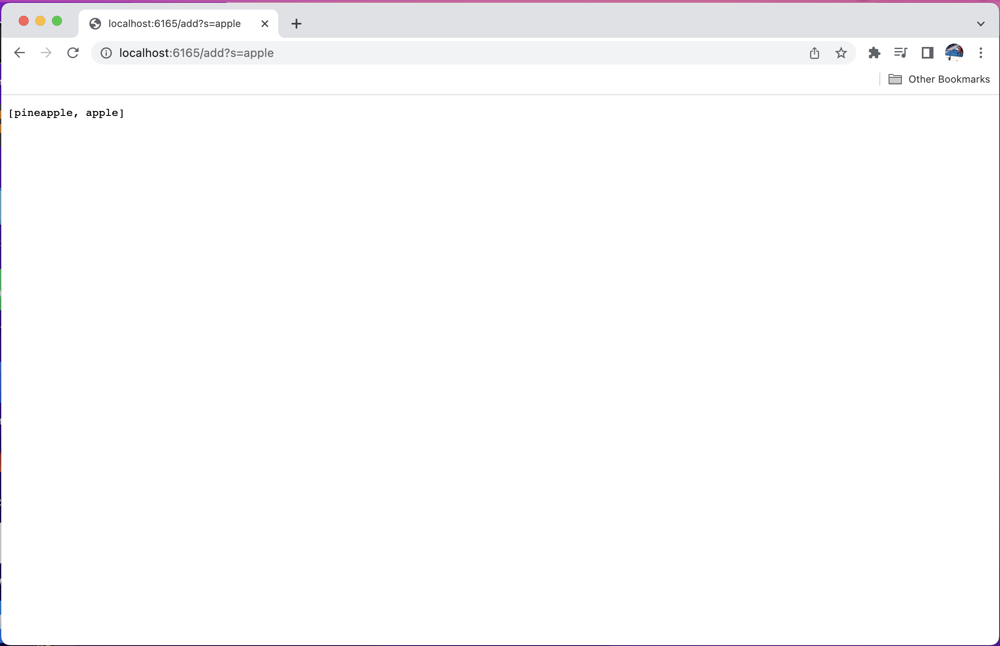
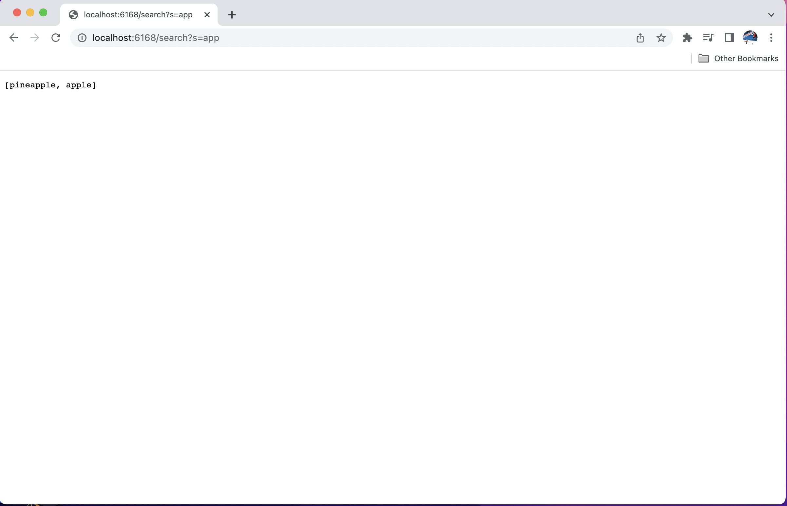

# Week 3 Lab Report
## Introduction
Hello! in this week's lab report, you will learn how to use a simple implementation of search engine on web server to receive different presentation brought by your code. 
## Part 1
*In this part, I will demonstrate using the simple searchEngine on path and Query to make it display different things.

*Here is my Simplest Search Engine:*

```
import java.io.IOException;
import java.net.URI;
import java.util.ArrayList;

class Search implements URLHandler {
    // The one bit of state on the server: a number that will be manipulated by
    // various requests.
    ArrayList<String> store_list1 = new ArrayList<>();
    public String handleRequest(URI url) {
        if (url.getPath().equals("/")) {
            return store_list1.toString();
        }
        else {
            System.out.println("Path: " + url.getPath());
            if (url.getPath().contains("/search")) {
                ArrayList<String> store_list2 = new ArrayList<String>();
                String[] elements = url.getQuery().split("=");
                if(elements[0].equals("s")) {
                    for(String s: store_list1) {
                        if (s.toUpperCase().contains(elements[1].toUpperCase())) {
                            store_list2.add(s);
                        }
                    }
                    return store_list2.toString();
                }
            }
            if (url.getPath().contains("/add")) {
                String[] store_list3 = url.getQuery().split("=");
                if (store_list3[0].equals("s")) {
                    store_list1.add(store_list3[1]);
                    return store_list1.toString();
                }
                ArrayList<String> store_list = new ArrayList<String>();
                store_list.add(store_list3[1]);
            }
            return "404 Not Found!";
        }
    }
}

class SearchEngine {
    public static void main(String[] args) throws IOException {
        if(args.length == 0){
            System.out.println("Missing port number! Try any number between 1024 to 49151");
            return;
        }

        int port = Integer.parseInt(args[0]);

        Server.start(port, new Search());
    }
}
```
*Here are screenshots for using the Simplest Search Engine to do adding and searching:*



> In this image, we can see that clearly the path is not just "/", so we will jump to the "else" statement in the above code. And because the path includes "/add" in its path, so it will trigger the second if statement under the first "else" statement. Then the Query will be splitted by "=", and the Query indeed contains "s", so the ArrayList store_list1 will change to an Arraylist of one elements instead of 0 element and stores the element at index 1 of the array splitted by the "=" and make that be String.



> In this image, it is similar to the one above, which means that its URL is not merely a "/" and contains "/add" in the path and "s" in the Query, so it will go throught the same path, and then splitted by the "=". Then the store_list will become size 1 instead of 0. The only difference with the one above is that the the element at index 1 of the array splitted by the "=" is "apple", so eventually the method will return a String "apple".



> In this image, it is different with those two above, in this case the path of the URL contains "/search" instead of "/add", so this will trigger the first if statement under the first "else" statement. Then it will do things similarly with the previous two pictures, that it will first make a storing ArrayList called storing_list2. And then split the "Query" by "=", then the first element of the array created by the "splitting" is indeed "s", so it will keep going, and then the code checks that in the Arraylist store_list, which already included "Pineapple" and "apple", if these elements contains the goal we want, which is "app", the code will store them to the store_list2, which will make the store_list2 changes to a length of 2 Array, and then turn the array into a  String.

## Part 2
*In this part, I will show some debugging and fixing the bug examples.*

Here is the first example:

> First of all, this is the inducing input that caused the bug to reveal itself: {1,3,5}


> Then the terminal will display the symptom caused by the bug:


> Finally, I fixed the code by creating a new array that has the same size as the integer arr array and reversing the order of the body of the for loop, adding the indexes starting from the beginning of the arr integer array to the indexes starting from the ending of the newly created array and changes the output to be new Array.

> The bug is causing the Symptom because the order of the assigning process is in the wrong order. the code: arr[i] = newArray[arr.length-i-1] is assigning 0 to elements in arr array. So after we fix the order and return the array that has the complete, reversed contents, the bug would be resolved. 

Here is the second example:
> First of all, the failure inducing inputs are 1,2,3:


> Then the terminal will display the symptom caused by the bug:


> Finally, I fixed the bug by changiong the while loop to move the code: n.next = new Node(value, null) out of the while loop.

> The bug is causing the symptom because if I put that inside the for loop, it will always set n.next to a node, which enables it to never break the condition of the while loop, so it will run into an infinite loop, causing the OutOfMemoryError.
