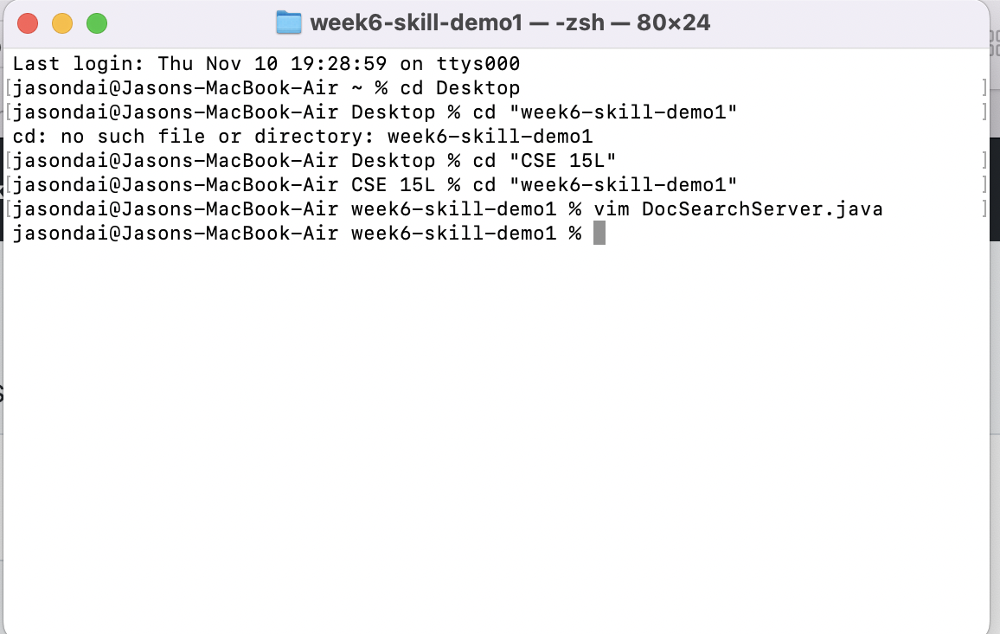

# Lab Report 4
## Introduction
Hello! In this week's lab, we will cover how to use vim to do tasks like changing the start parameter in a file's method to base of all its occurence. Let me show you how to do it. 

## Part 1: The Method display and explanation

`/("<Enter> <Shift>$ hh i +args[1] :wp<Enter>`

It seems pretty short right? Let me show you a more detailed demonstration:

*Step one*

First, let us try to search for a unique word that can instantly direct us to the place of where we want to change, so we can use /r(", which will bring us to the place where we want to change in the mai nmethod directly, because in this file, only that line contains: r("

*Step Two*

Have you seen that the cursor now jumps to thw line that we want to directly, now, let us try to go to the end of the line since that will save us more keystrokes to add stuff in the code.

*Step Three*

Then, let us just type h twice to move the cursor to the place right after the place where we want to add

*Step Four*

Now, let us enter the insert mode by typing i and type the things we want to add

*Step five*

Now, we have done the editing and we can save all the changes by using the `:wq<Enter>`

Now we are back here and finished our task.

## Part2: The Comparision between vim and modify+scp

Can you think of another way that we learned about how to modify files on remote server? Yes! the scp option. However, our old friend may not be as efficient as out new friend, vim, is in this case. Let me show you how I did these two ways of modifying files remotely, and let us see how many time they took me to complete the task.

*The scp method* 

So first, I need to change the file locally on VS Code, and then scp it to the remote server, here is how I do this: 

As you can see, by using this approach, I need to type a lot of things, such as modifying in the VS Code and then open another terminal to transfer the newly modified file to the remote server, however, by using vim, we can just login to the remote server and modify it using the method I mentioned above to quickly finish our job.

As I timed myself doing these two approaches, the scp method took me 1 minute and 15 seconds, and the vim method only took me 45 seconds. Can you see why we would want to learn vim? It saves you a lot of time. The difficulty that I have encountered is that I forgot some detail of how to use the scp command, and I forgot to add the :~/ for the forst time trying to use the scp.

## Two questions
(1) In my opinion, I think that I would like to use vim over the modify_scp method, because in the vim mode, we can easily jump around and use some command to help us go to the place we want to go, such as using the "$" to jump to the end of a line, and use the "/name" to search for all the occurence and use "n" to go to each occurence of the thing you are searching for. Therefore, I really like these commands, which makes the process of editing a file more efficient. So that is why I would prefer to use vim.

(2) I think nothing would affect my decision, because I feel like vim is a mode that exist no matter you are in remote or local server, so this allows you to make changes to files whenever and anywhere you want, and you do not need to do those extra steps like copying it to remote or local servers after making the changes. Also, we can bring up two terminals to use vim in the same screen, so you do not need to worry that moving to different files requires you to exit and enter the vim mode multiple times. 

## Conclusion
After reading this lab report, you should be able to understand how the method I mentioned in part 1 works, and the benefits of using the vim method to modify files. Thank you for your time and patience.
