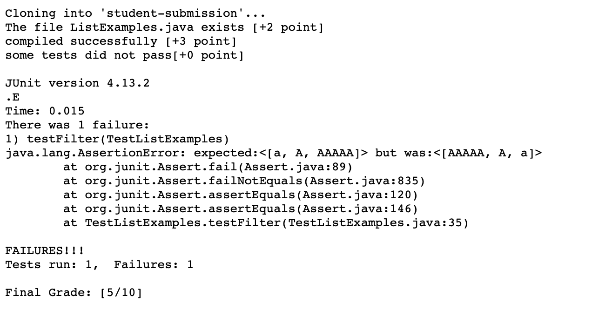
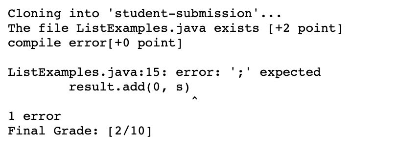

# Lab Report 9
## Introduction
Hello! Welcome to the last lab report of CSE 15L for this quarter. In this lab report, I will show my grade.sh and demonstrate how this grade.sh works with a submission sample.

## Part 1 - The Code and Examples
In the first part, let me show you the code and some examples of using the grade.sh with different submissions.

```
rm -rf student-submission
git clone $1 student-submission
cd student-submission

if [ -e "ListExamples.java" ]
then 
    echo "The file ListExamples.java exists [+2 point]"
    ((score+=2))
else 
    echo "The file ListExamples.java does not exist [+0 point]"
    echo "Final Grade: [0/10]"
    exit
fi
cp ../TestListExamples.java ./

javac -cp .:../lib/hamcrest-core-1.3.jar:../lib/junit-4.13.2.jar *.java 2> compile-error.txt
if [[ $? -eq 0 ]]
then
    echo "compiled successfully [+3 point]"
    ((score+=3))
else
    echo "compile error[+0 point]"
    echo ""
    cat compile-error.txt
    echo "Final Grade: [$score/10]"
    exit
fi

java -cp .:../lib/hamcrest-core-1.3.jar:../lib/junit-4.13.2.jar org.junit.runner.JUnitCore TestListExamples > test-error.txt
if [[ $? -eq 0 ]]
then
    echo "tests passed [+5 point]"
    ((score += 5))
else
    echo "some tests did not pass[+0 point]"
    echo ""
    cat test-error.txt
fi
echo "Final Grade: [$score/10]"
```
*Some test error*

https://github.com/ucsd-cse15l-f22/list-methods-lab3



*All correct*

https://github.com/ucsd-cse15l-f22/list-methods-corrected


*Compile error*

https://github.com/ucsd-cse15l-f22/list-methods-compile-error



## Part 2 - Trace
In this part, let me show you how does the grade.sh produce its result by using the "All correct" example.

```
rm -rf student-submission
git clone $1 student-submission
cd student-submission
```
In this part, since we are just creating and cloning the student-submission that we want to give a grade for, we are not doing any test or comparisons, so their stdout and stderr would have no thing, and these lines' return codes would all be 0, because there is no error in these lines.


```
if [ -e "ListExamples.java" ]
then 
    echo "The file ListExamples.java exists [+2 point]"
    ((score+=2))
else 
    echo "The file ListExamples.java does not exist [+0 point]"
    echo "Final Grade: [0/10]"
    exit
fi
```
In this part, we are trying to see whether the file, ListExamples.java" exist or not, if the student submission does not contain this file, or the file is saved in a wrong name, then these lines would be able to detect it and directly give the 0/10 score for this submission. However, in our example, the submission contains the wanted file name, so the stdout of our example would be "The file ListExamples.java exists [+2 point]"; the stderr would be empty, and the return codes would all be 0 because there is no error. The else part would not be activated because the file exists.
```
