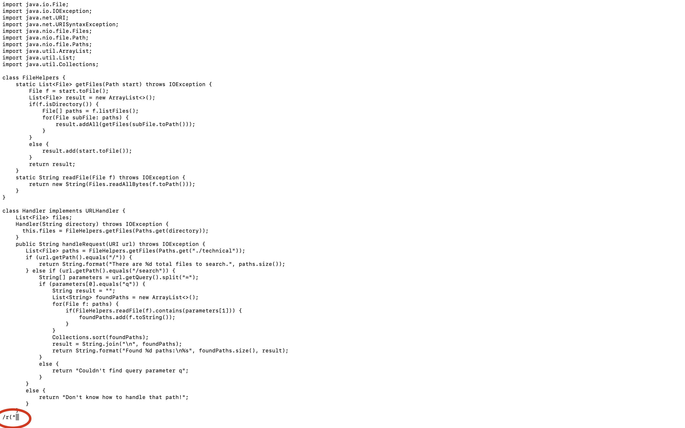
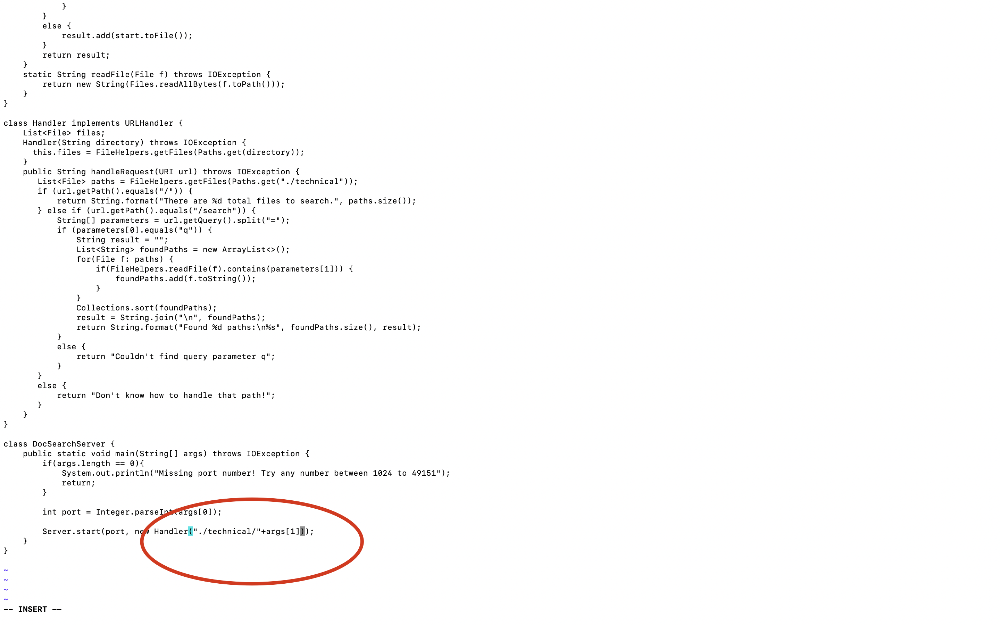

# Lab Report 4
## Introduction
Hello! In this week's lab, we will cover how to use vim to do tasks like changing the start parameter in a file's method to base of all its occurence. Let me show you how to do it. 

## The Method

`/("<Enter> <Shift>$ hh i +args[1] :wp<Enter>`

It seems pretty short right? Let me show you a more detailed demonstration:

*Step one*

First, let us try to search for a unique word that can instantly direct us to the place of where we want to change, so we can use /r(", which will bring us to the place where we want to change in the mai nmethod directly, because in this file, only that line contains: r("

*Step Two*

Have you seen that the cursor now jumps to thw line that we want to directly, now, let us try to go to the end of the line since that will save us more keystrokes to add stuff in the code.

*Step Three*

Then, let us just iuse two hs to move the cursor to the place right after the place where we want to add

*Step Four*

Now, let us enter the insert mode and type the things we want to add

*Step five*

Now, we have done the editing and we can save all the changes by using the `:wq<Enter>`
